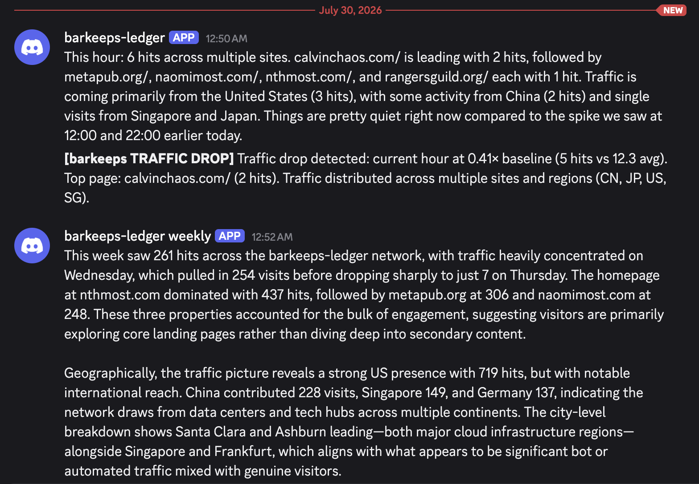

# barkeeps-ledger intelligence workflows

Three agent workflows that query a [barkeeps-ledger](https://github.com/conductor-oss/barkeeps-ledger)
instance and post traffic intelligence to Discord.


*Hourly digest, anomaly alert, and weekly narrative — all three running against a live barkeeps-ledger instance.*

## Setup

```bash
cp ../.env.example .env
# fill in all four values: ANTHROPIC_API_KEY, AGENTSPAN_SERVER_URL,
# BARKEEPS_BASE_URL, and DISCORD_WEBHOOK_URL
```

## Workflows

### `hourly_digest.py`

Posts a short 3-5 sentence summary of the last hour's traffic: top pages, visitor
geography, and trend vs the previous few hours.

```bash
python barkeeps/hourly_digest.py
```

Schedule hourly:
```cron
0 * * * * cd /path/to/agentspan-examples && python barkeeps/hourly_digest.py
```

### `anomaly_detector.py`

Compares the current hour against the 6-hour rolling average. Posts a Discord alert
only when traffic spikes ≥ 2× or drops ≤ 0.3× the baseline. Silent otherwise.

```bash
python barkeeps/anomaly_detector.py
```

Schedule every 15 minutes:
```cron
*/15 * * * * cd /path/to/agentspan-examples && python barkeeps/anomaly_detector.py
```

### `weekly_report.py`

Fetches 7 days of hourly data, top pages, and visitor geography, then writes
a 150-250 word narrative and posts it to Discord.

```bash
python barkeeps/weekly_report.py
```

Schedule Monday mornings:
```cron
0 9 * * 1 cd /path/to/agentspan-examples && python barkeeps/weekly_report.py
```

## barkeeps-ledger API

These workflows use the public read-only REST API:

| Endpoint | Description |
|---|---|
| `/api/hourly` | Hourly hit counts (30-day window) |
| `/api/rankings?window=N` | Top URLs in last N seconds |
| `/api/origins?window=N` | Top visitor countries |
| `/api/cities?window=N` | Top visitor cities |
| `/api/recent?n=N` | Latest N hits with metadata |
